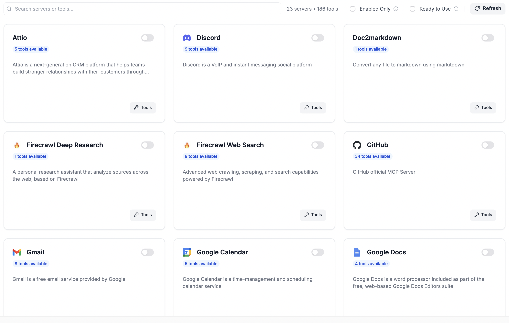
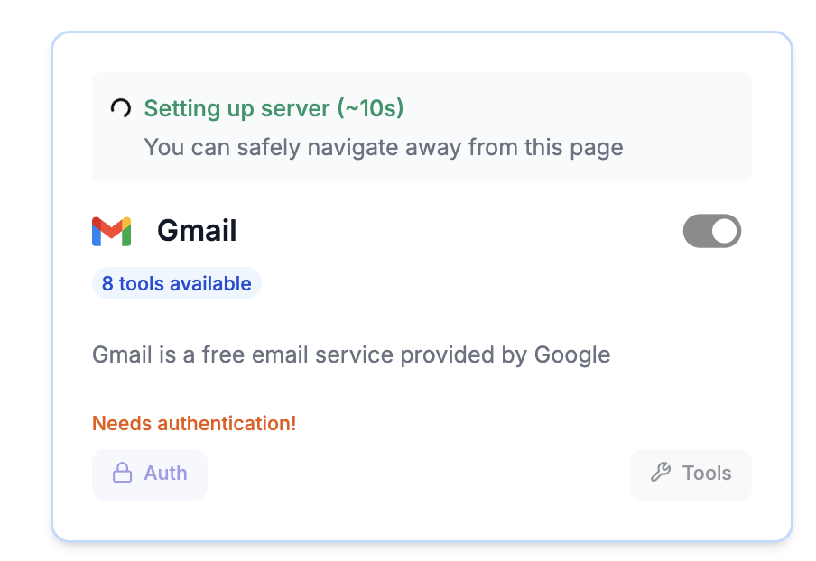
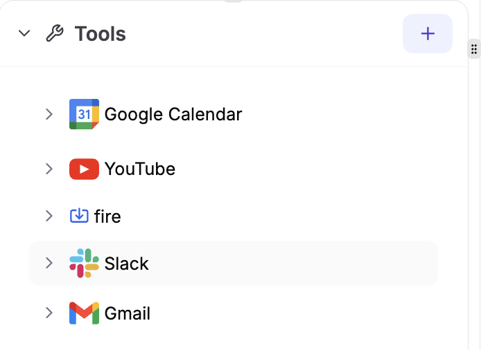
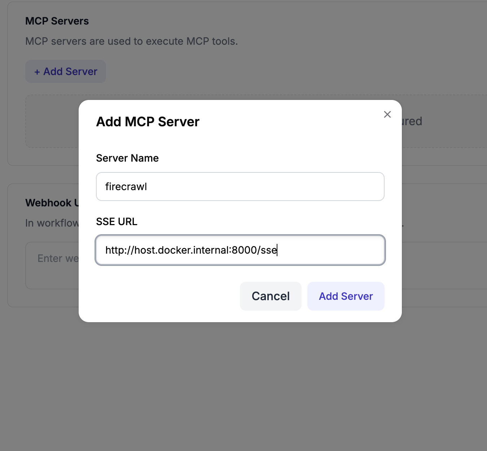
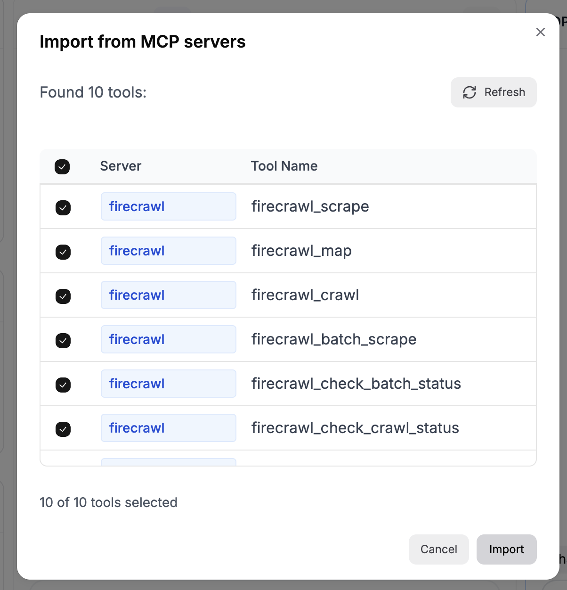
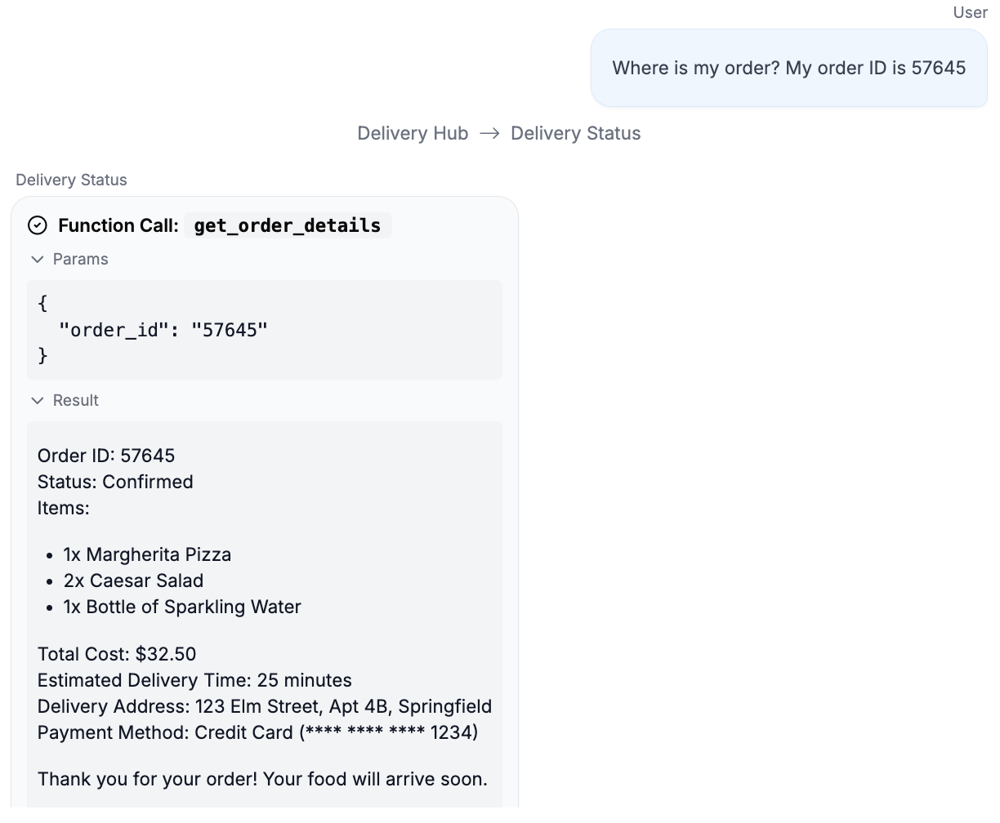

## Add tools to agents
In Rowboat, you can add tools to your agents by (a) selecting from a in-built library of MCP tools (b) adding your own customer MCP servers (c) integrating your APIs through a webhook (e) mocking tool calls to test the system.

### Adding MCP tools

#### Hosted MCP Library

Rowboat has partnered with  to provide a growing library of hosted MCP servers. You can obtain a 'KLAVIS_API_KEY' and add it to your env for the library to show up automatically under the tools section.

Enable any of the hosted MCP servers by clicking on the enable button. The server will take approximately 10 seconds to spin up.

For most servers, you will need to authorize it by clicking on the 'Auth' button and connecting to your account e.g. connecting to you github or slack account

The servers you have enabled will show up under tools section in the build view and can be added to any of the agents.

Note: For GSuite tools, you need to get the google client ID from your GSuite account and set it to the env variable 'KLAVIS_GOOGLE_CLIENT_ID'.

#### Custom MCP Server
You can add any running MCP server in Settings -> Tools.

You can use [supergateway](https://github.com/supercorp-ai/supergateway) to expose any MCP stdio server as an SSE server.

Now, you can import the tools from the MCP server in the Build view.

### Adding mock tools
You can mock any tool you have created by checking the 'Mock tool responses' option.

### Debug tool calls in the playground
When agents call tools during a chat in the playground, the tool call parameters and response are available for debugging real-time. For testing purposes, the platform can produce mock tool responses in the playground, without integrating actual tools.

