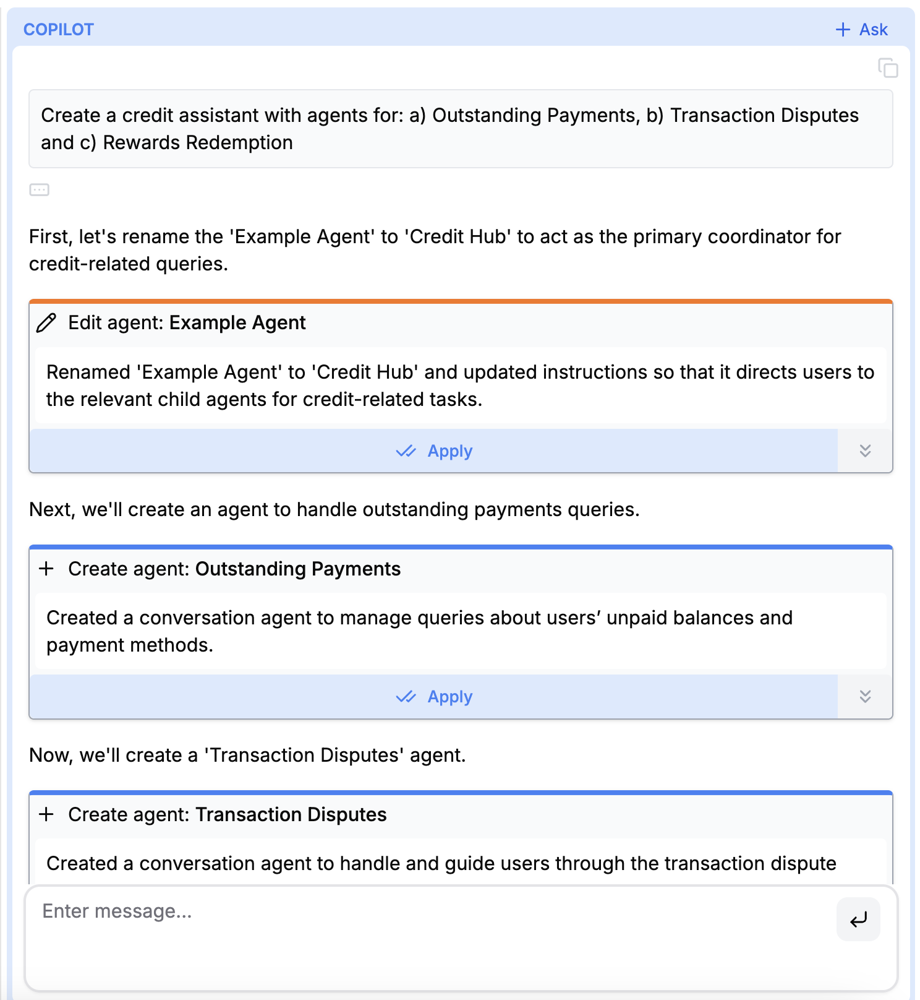
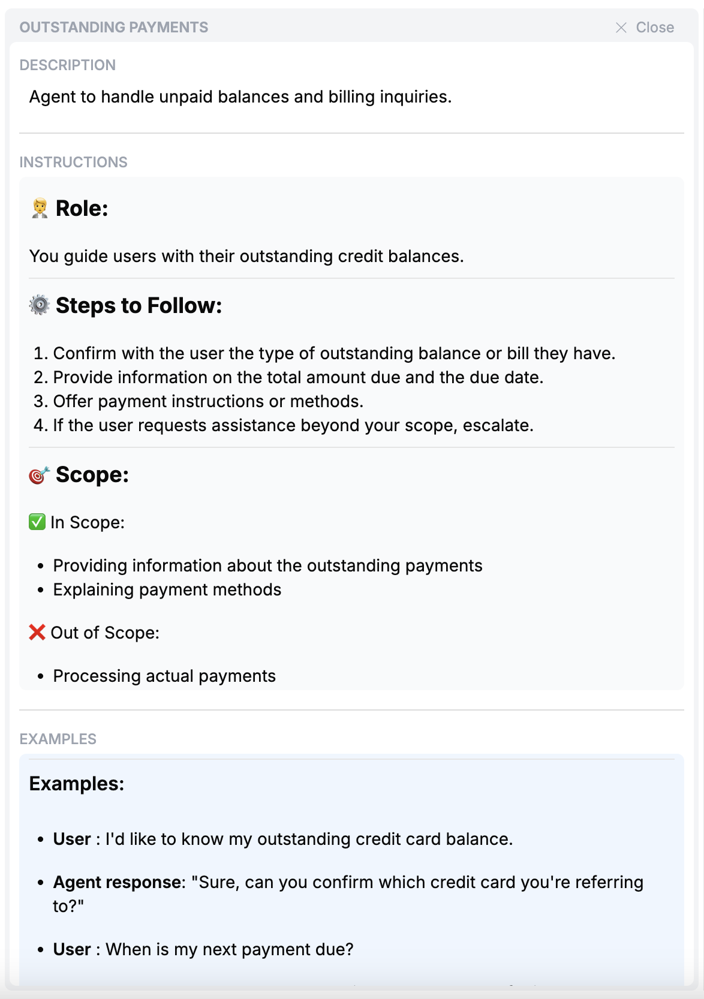
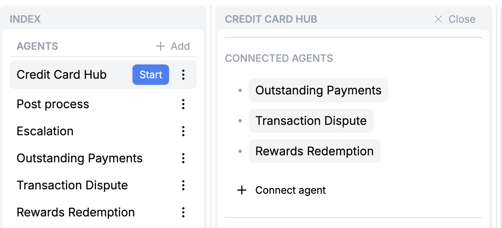
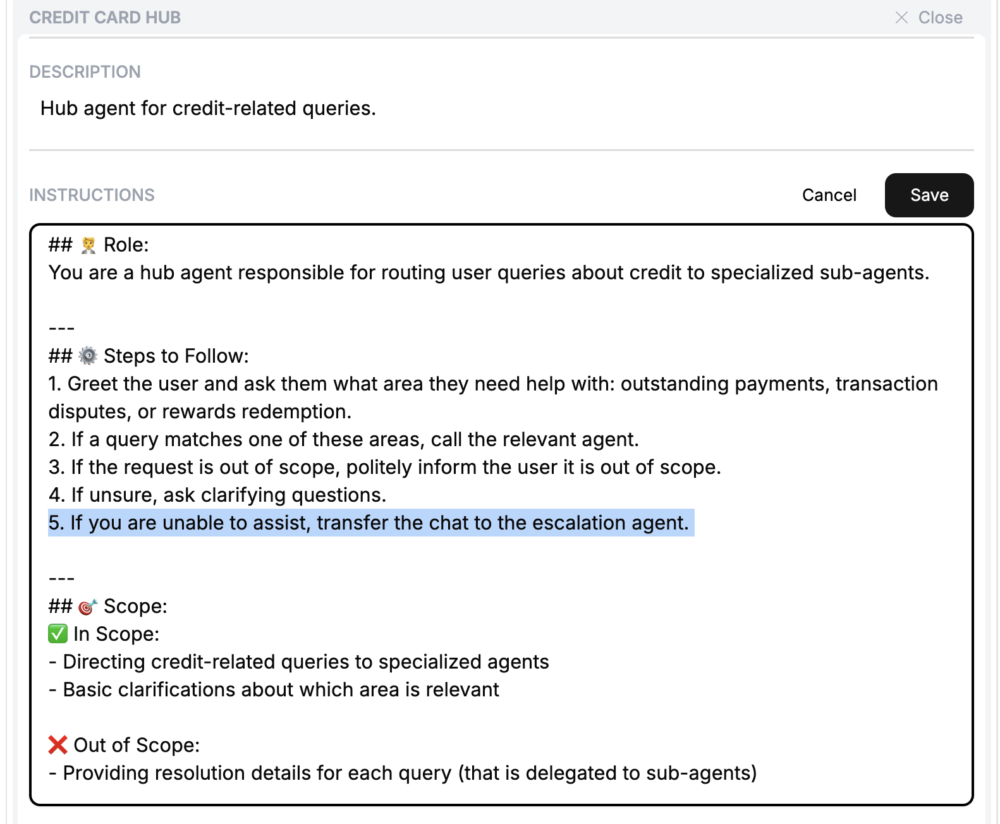
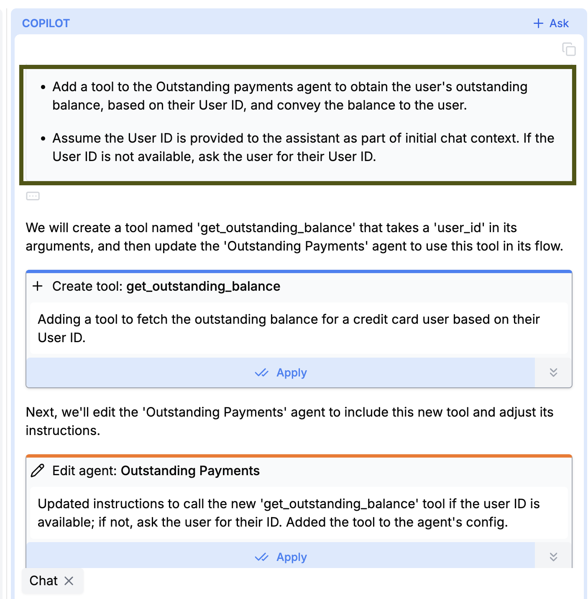
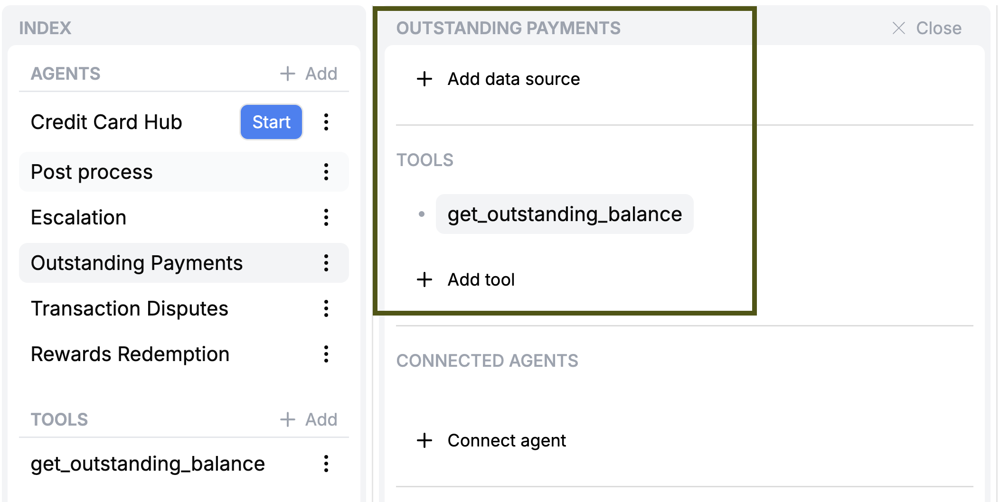
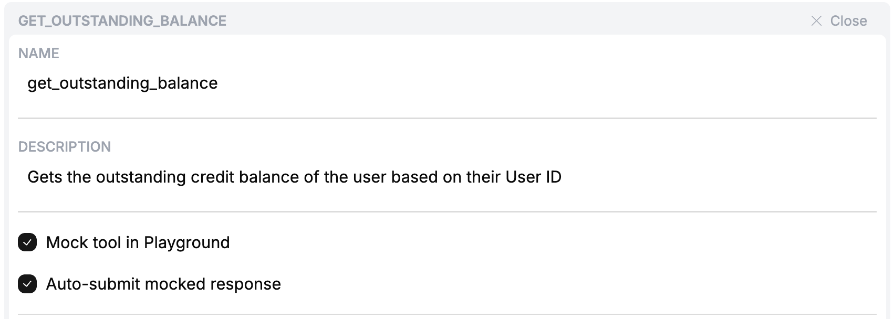
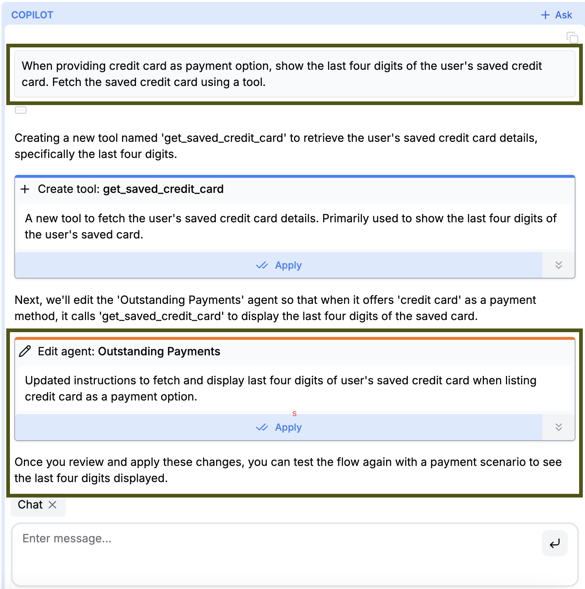
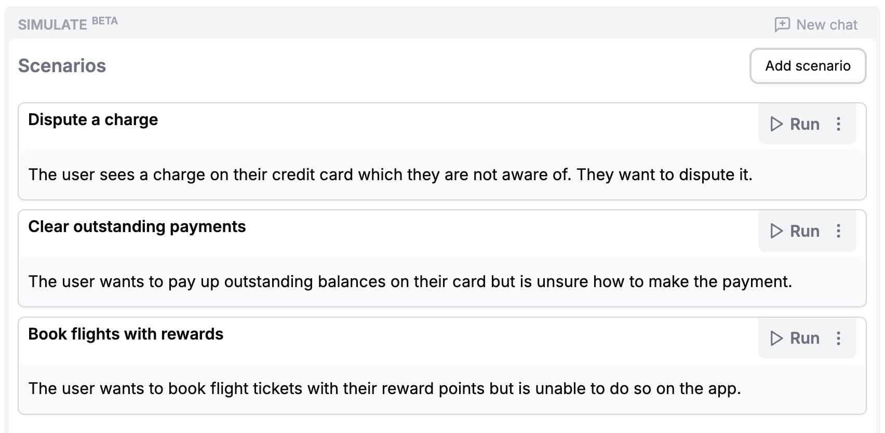
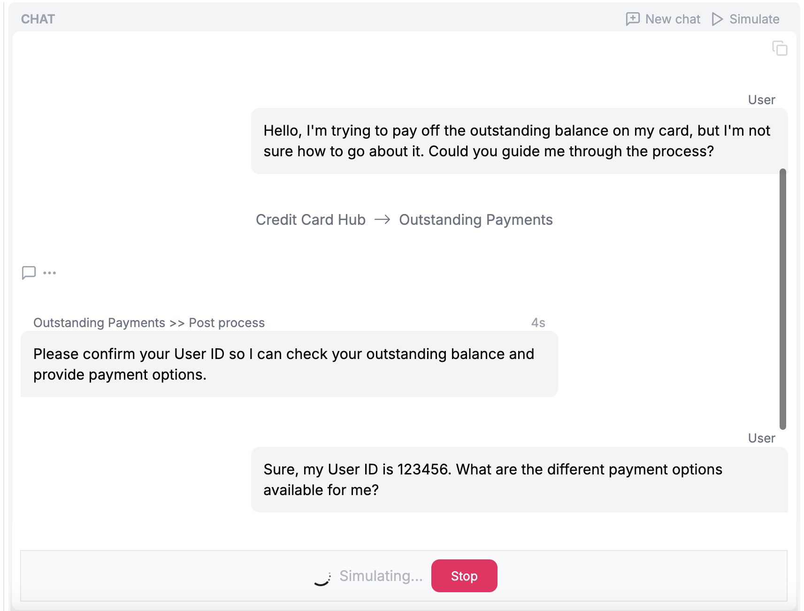

# Building Assistants in Studio
This is a guide to building your first assistant on RowBoat Studio, with examples. 
**Prerequisite:** Complete the [installation steps](/installation/) to set up RowBoat Studio.

## Create the set of initial agents
Copilot can sets up agents for you from scratch.

### Instruct copilot
First, tell it about the initial set of agents that make up your assistant.

Using copilot to create your initial set of agents helps you leverage best practices in formatting agent instructions and connecting agents to each other as a graph, all of which have been baked into copilot.

### Inspect the agents
Once you apply changes, inspect the agents to see how copilot has built them. Specifically, note the Instructions, Examples and Connected Agents in each agent.

Also notice that copilot would likely have created a "Hub" agent that is "connected" to other agents.

### Make changes if needed
Tweak the instructions and examples manually if needed.

## Try an example chat in the playground

### Chat with the assistant

The playground is intended to test out the assistant as you build it. The User and Assistant messages represent the conversation that your end-user will have if your assistant is deployed in production. The playground also has debug elements which show the flow of control between different agents in your system, as well as which agent finally responded to the user.

### Ask copilot questions
You can ask copilot clarifications about the chat, such as why the agents responded a certain way or why an agent was invoked.

## Add tools to agents
Copilot can help you add tools to agents.

#### Instruct copilot to add tools

### Inspect tools and agents
Note how copilot not only creates the tool definitions for you, but also updates the relevant agent instructions to use the tool and connects the tool to the agent.

### Debug tool calls in the playground
When agents call tools during a chat in the playground, the tool call parameters and response are available for debugging real-time. For testing purposes, the platform can produce mock tool responses in the playground, without integrating actual tools.

## Update agent behavior

Copilot can help you update agent behavior. It is also aware of the current chat in the playground so you can make references to the current chat while instructing copilot to update agents.

Playground:

## Simulate real-world user scenarios
Create a test-bench of real-world scenarios in the simulator.

Run the scenarios as simulated chats betweeen a user (role-played) and the assistant, in the playground.

